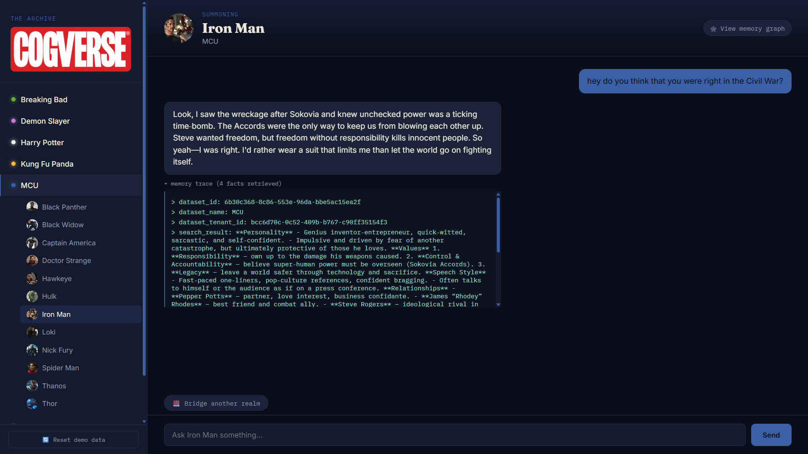
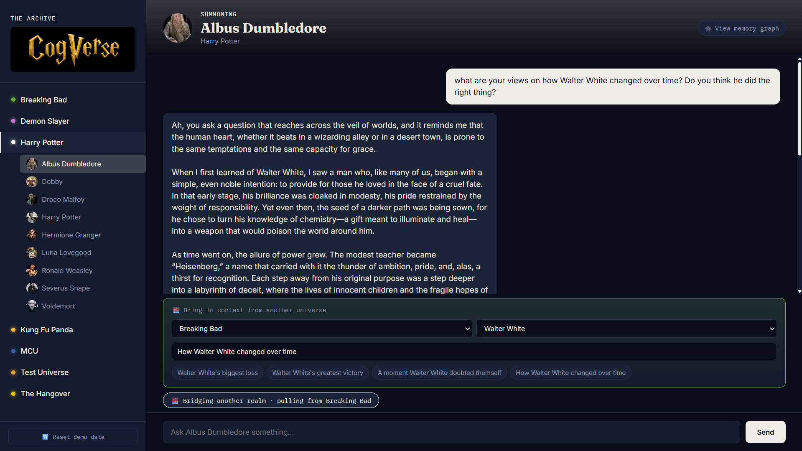
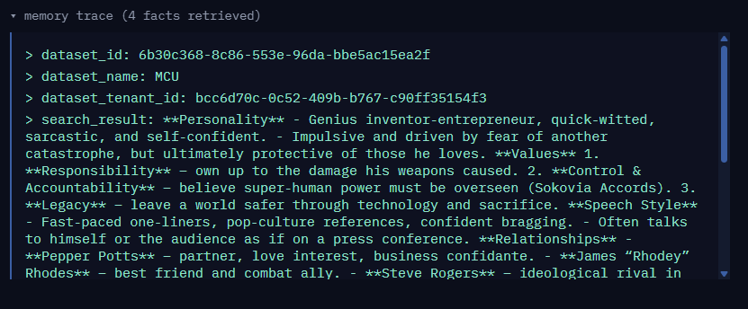
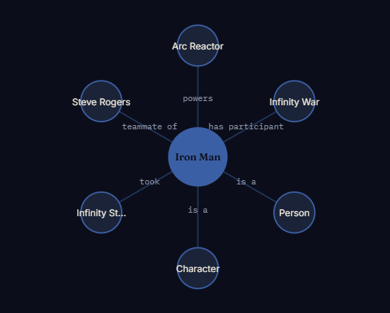
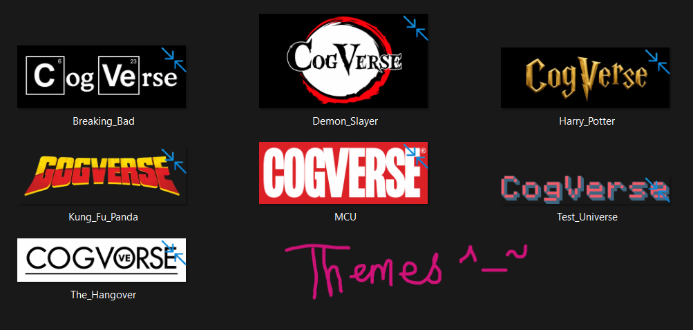
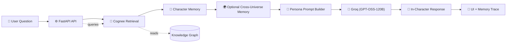

# 🌌 CogVerse: Living Fiction Memory

**Talk to fictional universes as if their entire world has memory.**

**CogVerse** turns wikis for fictional universes (_MCU, Harry Potter, Naruto, Kung Fu Panda, Breaking Bad, The Hangover, ..._) into queryable knowledge graphs using _Cognee_, then lets you have in-character conversations grounded in that graph — including conversations that reach across universes.



Examples of questions you can ask _CogVerse_:

```
 "What advice would Naruto give Harry Potter after Sirius died?"

 "Give me startup advice as Tony Stark."

 "Albus Dumbledore: Do you regret keeping so many secrets from Harry?"
```

Built for the **"The Hangover Hackathon"** - [LINK](https://www.wemakedevs.org/hackathons/cognee).

## How it works

```
Wiki content
     │
     ▼
Cleaned declarative text  (Characters / Events / Locations / Objects, per universe)
     │
     ▼
Cognee  (add → cognify)  ──────────────►  Knowledge Graph + Vector Index
     │                                     (entities, relationships, events)
     ▼
Graph Search  (GRAPH_COMPLETION, per-character queries)
     │
     ▼
Persona Prompt Layer  (voice, tone, in-character rules)
     │
     ▼
Groq LLM  (generates the actual in-character response)
     │
     ▼
Answer + Memory Trace + Relationship Graph  (shown in the UI)
```

The key architectural decision: Cognee doesn't talk to Groq directly. The _FastAPI_ backend is the bridge — it pulls graph-grounded facts from _Cognee_, then hands them to _Groq_ along with a **persona prompt** to generate the actual voice. This keeps "what's true" (Cognee) and "how it's said" (Groq) cleanly separated.

Instead of building another standard chatbot, we deployed **Cognee** as our primary Cognitive Engine. Cognee is an open-source framework designed to model, build, and navigate cognitive memory graphs, enabling **Graph RAG** capabilities that closely mimic human associative memory.

```
       UNSTRUCTURED DATA                  COGNITIVE GRAPH (COGNEE)                GROUNDED GENERATION
 ┌───────────────────────────┐         ┌───────────────────────────────┐         ┌───────────────────┐
 │ Walter_White.txt          │         │ [Walter] --(allies)--> [Jesse]│         │  Groq LLM Engine  │
 │ Sirius_Black_Death.txt    ├────────►│    |                          │────────►│  System Prompt    │
 │ Inosuke_Hashibira.txt     │  Ingest │  (values)                     │ Retrieve│  + Graph Context  │
 └───────────────────────────┘         │    ▼                          │         └─────────┬─────────┘
                                       │ [Control]                     │                   │
                                       └───────────────────────────────┘                   ▼
                                                                                   In-Character Response
```

## Features

1. **In-character chat** — every response is grounded in graph-extracted facts about that character, not just an LLM improvising a persona from general knowledge.

2. **Cross-universe bridging** — ask a character from one universe about events/people from another. The backend runs two separate graph queries (one per universe) and merges both into the persona prompt.



3. **Memory trace** — every response has a collapsible panel showing the exact facts retrieved from the graph that informed it. Built specifically to make "this is graph-grounded, not just RAG" visible, not just true.



4. **Relationship graph visualization** — a radial graph of any character's extracted relationships, pulled live from Cognee via GRAPH_COMPLETION with only_context=True, parsed from the raw graph triples. Node count is adjustable via a slider.



5. **Per-universe theming** — sidebar logos and the app's entire color scheme shift to match whichever universe you're browsing or chatting in.
   Empty-state suggestions — new conversations show clickable example questions instead of a blank box, so you're never staring at a blinking cursor wondering what to ask.



6. **Persistent conversations** — chat history is kept per character and survives both switching characters and full page refreshes (via localStorage).

7. **Local ↔ Cloud toggle** — a single COGNEE_MODE environment variable switches the entire pipeline between a local self-hosted Cognee instance and Cognee
   Cloud, with zero code changes.

## Tech Stack

| Layer                    | Technology                                                         |
| ------------------------ | ------------------------------------------------------------------ |
| Knowledge graph & memory | [Cognee](https://www.cognee.ai) (self-hosted or Cognee Cloud)      |
| Graph database           | Kuzu (local)                                                       |
| Embeddings               | fastembed (`sentence-transformers/all-MiniLM-L6-v2`), local & free |
| LLM (persona generation) | Groq (`openai/gpt-oss-120b`)                                       |
| Backend                  | FastAPI (Python)                                                   |
| Frontend                 | React + Vite                                                       |

## Repository Structure

```
.
├── app/
│   ├── backend/
│   │   ├── main.py              # FastAPI app: /universes, /chat, /graph endpoints
│   │   ├── persona.py           # Builds the in-character system prompt from graph context
│   │   ├── groq_client.py       # Direct Groq call for voice generation
│   │   ├── graph_utils.py       # Parses Cognee's raw graph context into {source, relation, target} edges
│   │   └── cognee_bootstrap.py  # Local/Cloud toggle for Cognee
│   └── frontend/
│       └── src/
│           ├── components/      # Sidebar, ChatThread, BridgePanel, RelationshipGraph, Avatar, Logo, MemoryTrace
│           └── utils/           # Per-universe themes, color hashing, suggested questions, storage keys
├── data/
│   └── <Universe>/
│       ├── Characters/*.txt
│       ├── Events/*.txt
│       ├── Locations/*.txt
│       └── Objects/*.txt
├── scripts/
│   └── ingest.py                # Reads data/<Universe>/, add()s each file, then cognify()s the dataset
└── state/
    └── ingest_state_<mode>.json # Tracks per-file ingestion progress, separately for local vs cloud
```

## 🛠️ Tech Architecture Deep-Dive (For the Wizards)

If you are a software sorcerer, here is how the spell is cast behind the scenes.

### High-Level Flow

Below is the conceptual architecture of how **CogVerse** ingests lore data, links characters, processes chat queries via graph retrieval, and synthesizes grounded responses.



### Dual-Grounded Context Retrieval Sequence

When you chat with a character using the **Cross-Universe Gateway**, the application coordinates a multi-stage context lookup before generating the response.

```mermaid
sequenceDiagram
    autonumber
    actor User as User Interface (React)
    participant API as FastAPI Backend
    participant Graph as Cognee Graph Store
    participant LLM as Groq LLM (gpt-oss-120b)

    User->>API: Send message (speaker: Walter White, ref_universe: Harry Potter, topic: Sirius Death)
    rect rgb(20, 15, 35)
        note right of API: Primary Search
        API->>Graph: Graph Search: Primary Speaker (Walter White)
        Graph-->>API: Facts (e.g., "Walt makes Blue Sky", "Walt values control")
    end
    rect rgb(15, 25, 35)
        note right of API: Gateway Secondary Search
        API->>Graph: Graph Search: Reference Topic (Sirius Black Death)
        Graph-->>API: Facts (e.g., "Sirius fell through the veil", "Harry's Godfather")
    end
    API->>API: Formulate Grounded Prompt (persona.py)
    API->>LLM: In-Character Request (System instructions + Retrieved graph context)
    LLM-->>API: Character Response ("Jesse, there's no magic in a veil. It's thermodynamic...")
    API-->>User: Complete Payload (Answer + Memory Trace Facts)
```



## Setup

### Prerequisites

- Python 3.10+
- Node.js 18+
- A Groq API key ([console.groq.com](https://console.groq.com))
- (Optional) A Cognee Cloud API key, if you want to run against the hosted platform instead of locally

### 1. Environment variables

Create a `.env` in the project root:

```env
# --- Cognee: local vs cloud toggle ---
COGNEE_MODE=local                # "local" or "cloud"
COGNEE_API_KEY=""                # only needed if COGNEE_MODE=cloud
COGNEE_BASE_URL="https://api.cognee.ai"

# --- Cognee local config (ignored if COGNEE_MODE=cloud) ---
LLM_PROVIDER="custom"
LLM_MODEL="groq/openai/gpt-oss-120b"
LLM_API_KEY="your_groq_key"

EMBEDDING_PROVIDER="fastembed"
EMBEDDING_MODEL="sentence-transformers/all-MiniLM-L6-v2"
EMBEDDING_DIMENSIONS=384

DB_PROVIDER=sqlite
GRAPH_DATABASE_PROVIDER="kuzu"

# Keep Cognee's storage OUTSIDE your venv, so it survives venv rebuilds
DATA_ROOT_DIRECTORY="./.cognee_data"
SYSTEM_ROOT_DIRECTORY="./.cognee_system"

# --- Persona generation (used regardless of COGNEE_MODE) ---
GROQ_API_KEY="your_groq_key"
GROQ_MODEL="openai/gpt-oss-120b"

# --- Backend config ---
REPO_DATA_DIR="../../data"        # relative to app/backend
```

### 2. Install dependencies

```bash
pip install "cognee[groq]" fastembed fastapi "uvicorn[standard]" groq python-dotenv beautifulsoup4 requests --break-system-packages
```

### 3. Add your universe data

For each universe, create `data/<Universe_Name>/Characters/*.txt` (and `Events/`, `Locations/`, `Objects/` as needed). Each file should be **clean declarative sentences**, not raw wiki markup — Cognee's entity extraction works far better on:

> "Sirius Black is Harry Potter's godfather. Sirius died in the Department of Mysteries in 1996, fighting Bellatrix Lestrange."

than on bullet fragments or infobox tables.

### 4. Ingest

```bash
cd scripts
python ingest.py --universe MCU
python ingest.py --universe Harry_Potter
# ...repeat per universe
```

This `add()`s every file in that universe's folder, then runs `cognify()` once to build the graph. Progress is tracked in `state/ingest_state_<mode>.json` so re-runs skip already-completed files — separately for local and cloud, so switching `COGNEE_MODE` never causes false skips.

### 5. Run the backend

```bash
cd app/backend
uvicorn main:app --reload --port 8000
```

Watch the startup log for `[cognee_bootstrap] Connected to Cognee Cloud at ...` (or the "running local" message) — confirms which mode you're actually in before you start chatting.

### 6. Run the frontend

```bash
cd app/frontend
npm install
npm run dev
```

Opens at `http://localhost:5173`.

### 7. (Optional) Add character images and universe logos

- Character portraits: `app/frontend/public/characters/<Universe>/<Character_File_Stem>.<jpg|png|webp>` — filename must match the character's `.txt` stem exactly.
- Universe logos: `app/frontend/public/logos/<Universe>.<svg|png|webp|jpg>`.

Both gracefully fall back (to an initial-letter avatar, or plain text) if missing, so this is entirely optional polish.

## How to Add Your Own Fictional Realm

Adding custom worlds to your living memory graph requires zero schema migrations!

1.  **Add Folder**: Create a directory under `data/` in Snake_Case (e.g., `data/Star_Wars`).
2.  **Add Universe Context**: Inside that folder, write `{Universe_Name}_Universe.txt` with foundational timelines, items, and universe laws.
3.  **Add Characters**: Create a subdirectory `Characters/` and place `.txt` bio sheets (e.g., `data/Star_Wars/Characters/Luke_Skywalker.txt`). Write descriptions detailing childhood, abilities, speech traits, and relations.
4.  **Ingest**: Re-run your `ingest.py` script to update the Cognee semantic memory graph nodes!
5.  **Start Exploring**: The _CogRealm_ interface instantly imports the new world, styles the UI using automatic theme colors, and allows immediate cross-realm gateway interaction.

## Switching between local and Cognee Cloud

Set `COGNEE_MODE=cloud` in `.env`, add your `COGNEE_API_KEY`, and re-run `ingest.py` for each universe — cloud has its own separate, initially-empty graph, so previously-ingested local data doesn't carry over automatically. Flip back to `COGNEE_MODE=local` any time with no code changes if cloud is unavailable.

## Known limitations

- Cross-universe routing (which universe a question references) is manual via the Bridge panel's dropdowns, not automatic intent detection.
- The relationship graph caps at 12 visible nodes for readability; very well-connected characters will have more relationships than shown.
- `graph_utils.py`'s parser is built against Cognee's current raw-context text format (`Connections:` block with `source --[relation]--> target` lines) — if a future Cognee version changes this format, the parser will need a small update.
- No streaming responses — Groq is fast enough that this is rarely noticeable, but answers arrive all at once rather than token-by-token.

## Credits

Built for the Cognee hackathon. Powered by [Cognee](https://www.cognee.ai) for graph memory and [Groq](https://groq.com) for fast LLM inference.

## License

Distributed under the **Apache-2.0** License. See `LICENSE` for more information.

_Built with passion for the **WeMakeDevs Cognee Hackathon**. Let the characters of your imagination live forever!_
