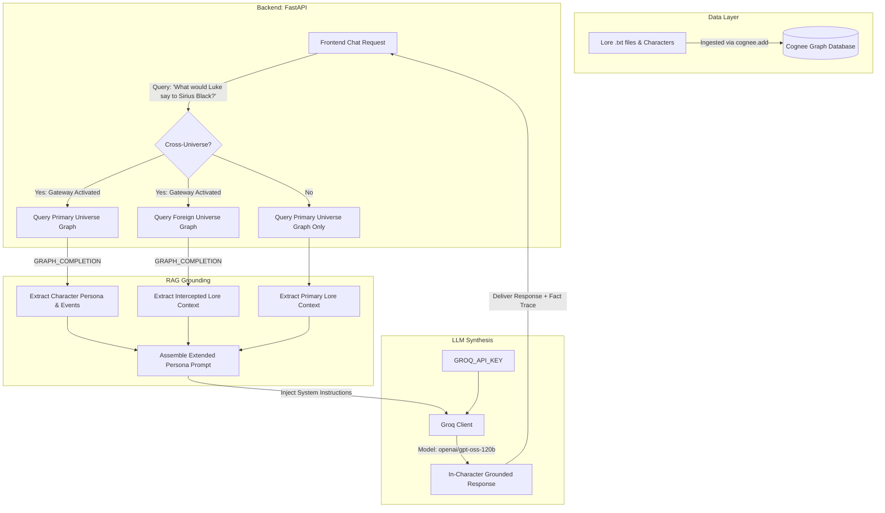

# 🌌 CogRealm: Living Fiction Memory

> **Where Fiction Remembers.**  
> *An interactive, dual-grounded living fiction memory system where legendary characters come alive, backed by real-time lore search and cross-universe gateway synthesis.*

---

## 🎬 The Backstory (For Mere Mortals)

Have you ever tried chatting with a character in a standard AI playground, only to feel the sudden pang of disappointment when they break character? Maybe they forgot who their allies were, hallucinated a timeline that never existed, or broke the fourth wall entirely to remind you, *"As an AI language model..."* 

We wanted to fix that. Fictional characters are more than just a list of catchphrases; they are defined by their lived history, their relationships, and the canonical laws of the worlds they inhabit.

**CogRealm** is a portal into the living minds of fictional legends. Characters in CogRealm are tethered to a **dynamic memory graph** of their home universes. They do not guess; they *remember*.

---

## 🏆 WeMakeDevs x Cognee Hackathon: The Core Challenge

CogRealm was custom-built for the [WeMakeDevs Cognee Hackathon](https://www.wemakedevs.org/hackathons/cognee). The central theme of our project is demonstrating how **unstructured text datasets** can be transformed into a **living, traversable cognitive memory topology** that directly solves the fundamental limitations of modern conversational Large Language Models.

### 🧠 The Core Problem with Standard AI Characters
1. **The Vector RAG Bottleneck**: Traditional Retrieval-Augmented Generation (RAG) breaks text files down into arbitrary chunks, embeds them, and performs mathematical cosine-similarity lookups. If you ask Walter White, *"What do you think about Harry Potter's Godfather dying?"*, standard Vector RAG looks for chunks containing both "Walter White" and "Godfather dying". It fails to establish the **relationship** between characters, their world laws, and their core values, returning irrelevant snippets.
2. **Loss of Entity relationships**: Standard vector databases do not understand that *Sirius Black* is *Harry Potter's Godfather*, or that *Walter White* values *control* and *family*. They see these as isolated string vectors rather than nodes in a complex graph network.
3. **Context Window Exhaustion**: Shoving massive lore summaries, character wikis, and historical timelines into the LLM context window is expensive, slow, and leads to the "lost in the middle" phenomenon where models ignore instructions.

---

## 🛠️ The Solution: How CogRealm Uses Cognee

Instead of building another standard chatbot, we deployed **Cognee** as our primary Cognitive Engine. Cognee is an open-source framework designed to model, build, and navigate cognitive memory graphs, enabling **Graph RAG** capabilities that closely mimic human associative memory.

```
       UNSTRUCTURED DATA                  COGNITIVE GRAPH (COGNEE)                GROUNDED GENERATION
 ┌───────────────────────────┐         ┌───────────────────────────────┐         ┌───────────────────┐
 │ Walter_White.txt          │         │ [Walter] --(allies)--> [Jesse]│         │  Groq LLM Engine  │
 │ Sirius_Black_Death.txt    ├────────►│    |                          │────────►│  System Prompt    │
 │ Inosuke_Hashibira.txt     │  Ingest │  (values)                    │ Retrieve│  + Graph Context  │
 └───────────────────────────┘         │    ▼                          │         └─────────┬─────────┘
                                       │ [Control]                     │                   │
                                       └───────────────────────────────┘                   ▼
                                                                                   In-Character Response
```

### 1. Ingestion & Graph Schema Mapping (`cognee.add`)
During backend ingestion in `app/backend/ingest.py`, unstructured lore datasets (character sheets, timeline events, locations, item descriptions) are fed into Cognee:
```python
import cognee

async def ingest_multiverse_data():
    # Adding universe lore files to Cognee's cognitive pipeline
    await cognee.add(
        data_path = "data/Breaking_Bad/Breaking_Bad_Universe.txt",
        dataset_name = "breaking_bad"
    )
    # Adding individual character files to map their identities
    await cognee.add(
        data_path = "data/Breaking_Bad/Characters/Walter_White.txt",
        dataset_name = "breaking_bad"
    )
    # Triggering the graph construction & cognitive parsing pipeline
    await cognee.cognify()
```
Cognee parses these text files, automatically extracts entities (Characters, Artifacts, Locations, Events), and maps their semantic relationships into a unified **Graph database**.

### 2. Search & Associative Path Traversal (`cognee.search`)
When a user asks a question, the backend uses Cognee’s semantic search capabilities to navigate the graph. Rather than returning raw chunks, Cognee performs entity resolution and returns a **subgraph** of related facts, entities, and memories.
* **Primary Query**: If chatting with *Walter White*, Cognee retrieves his core node, locating adjacent facts (his formula, his family, his partners).
* **Gateway Queries**: If the Cross-Universe Gateway is active, Cognee performs a parallel search against the target universe (e.g., *Harry Potter*) for keywords like "Sirius Black Death" or "The Veil", returning the context of the event.
* **The Result**: These two retrieved subgraphs are unified into a structured list of semantic facts (displayed in our **Memory Trace** sidebar) and injected directly into the system prompt.

---

## 🌟 How it Works (No Magic Required!)
1.  **Choose Your Realm**: Slide through legendary dimensions like *Demon Slayer*, *Breaking Bad*, *Harry Potter*, or *Kung Fu Panda*. Watch the entire user interface shift, morphing its accent tones, buttons, and background gradients to match the visual vibe of that specific world.
2.  **Select Your Character**: Initiate a live communion with legendary figures. You will be greeted with customized starter questions calculated specifically from their current memory node.
3.  **Witness the Cognitive Memory Trace 🧠**: Look at the active **Memory Trace panel**! As your conversation flows, this panel lights up in real time, exposing the factual connections, relationships, items, and locations retrieved from the graph database to formulate that specific response.
4.  **Open the Cross-Universe Gateway 🌌**: Flip the gateway control at the top to let a character from one universe react to events or files from another. Watch them analyze foreign canonical texts through the lens of their unique values, canonical voice, and life experiences.

---

## 💡 Why CogRealm? (The "Living Fiction" Engine)

Traditional conversational AI operates like a blank slate—it has general knowledge of popular books and movies, but lacks a local memory index. If you ask standard AI to act as a character, it has to rely on generic model weights, which often leads to inaccurate facts, inconsistent tones, and flat responses.

**CogRealm changes this by introducing a "Living Fiction" Engine:**
*   **Structured Memory Over Static Text**: Instead of dumping raw books into prompt boxes (which overflows context limits), CogRealm indexes each universe as a living web of nodes (characters, locations, events, factions, and relics). 
*   **The Power of Association**: Fictional figures think like humans. If you ask Walter White about his family, the engine traverses the memory graph, exciting adjacent nodes like "Skyler White," "Flynn," and "Walter Jr." to pull immediate, highly localized facts into the chat.
*   **Cognitive Continuity**: Even if you ask a complex, open-ended question, the character remains grounded because their foundational universe data is loaded directly into their working memory.

---

## 🚀 Deep Feature Spotlight

We didn't just build a wrapper; we focused on high-fidelity user experiences and rigorous engineering boundaries:

### 🎭 1. Uncompromising Character Personas
Standard AI chats feel generic because they lack a clear voice constraints. In CogRealm, every prompt is compiled under strict persona framing. Characters will speak in their native tongue, use their canonical catchphrases, adapt their vocabulary density (from Master Oogway's mystical proverbs to Walter White's cold, analytical chemistry jargon), and remain completely grounded in their timeline.

### 🧠 2. Real-Time Memory Trace Panel
To ensure maximum transparency, we built the **Memory Trace** panel into the core layout. 
*   **Aesthetic Integration**: Designed to look like a high-tech debugger or a cognitive scanner.
*   **Custom Scrollbar Mechanics**: Standard browser scrollbars look blocky and ruin the atmospheric immersion. We implemented custom CSS WebKit scrollbars that dynamically blend into the dark slate canvas, matching our premium theme colors with transparent padding boundaries.
*   **Grounding Proof**: It lists the exact raw fact nodes retrieved from the graph database for that turn, proving to hackathon judges and users that the character's knowledge is mathematically grounded in their universe's directory.

### 🌌 3. The Cross-Universe Gateway
The flagship feature of CogRealm. When activated, it enables a dual-retrieval pipeline:
*   **How it feels**: Imagine feeding Luke Skywalker a text log detailing the tragedy of the Red Wedding from *Game of Thrones*, or showing Harry Potter a file describing how Walter White constructed his empire.
*   **The logic**: The backend performs two parallel graph queries, merges the primary speaker's cognitive frame with the secondary world's factual logs, and pipes them into our Groq LLM engine to synthesize a reaction that stays 100% in character.

### 📜 4. The Lore Ledger
A full-screen explorer for users who want to read before they speak. You can browse the canonical records, historical timelines, item sheets, and location biographies of any universe in our registry. It acts as an in-app wiki, dynamically loaded from our file-system database.

### ⚡ 5. Context-Aware Conversation Starters
Conversations can feel intimidating if you don't know where to start. The client requests dynamically generated starters upon character selection. The backend uses the character's core memory node to formulate three tailored, high-interest canonical prompt choices, rendered as smooth, hover-reactive state buttons.

---

## 🛠️ Tech Architecture Deep-Dive (For the Wizards)

If you are a software sorcerer, here is how the spell is cast behind the scenes.

### 🏗️ High-Level Flow

Below is the conceptual architecture of how CogRealm ingests lore data, links characters, processes chat queries via graph retrieval, and synthesizes grounded responses.



---

### 🧬 Dual-Grounded Context Retrieval Sequence

When you chat with a character using the **Cross-Universe Gateway**, the application coordinates a multi-stage context lookup before generating the response.

```mermaid
sequenceDiagram
    autonumber
    actor User as User Interface (React)
    participant API as FastAPI Backend
    participant Graph as Cognee Graph Store
    participant LLM as Groq LLM (gpt-oss-120b)

    User->>API: Send message (speaker: Walter White, ref_universe: Harry Potter, topic: Sirius Death)
    rect rgb(20, 15, 35)
        note right of API: Primary Search
        API->>Graph: Graph Search: Primary Speaker (Walter White)
        Graph-->>API: Facts (e.g., "Walt makes Blue Sky", "Walt values control")
    end
    rect rgb(15, 25, 35)
        note right of API: Gateway Secondary Search
        API->>Graph: Graph Search: Reference Topic (Sirius Black Death)
        Graph-->>API: Facts (e.g., "Sirius fell through the veil", "Harry's Godfather")
    end
    API->>API: Formulate Grounded Prompt (persona.py)
    API->>LLM: In-Character Request (System instructions + Retrieved graph context)
    LLM-->>API: Character Response ("Jesse, there's no magic in a veil. It's thermodynamic...")
    API-->>User: Complete Payload (Answer + Memory Trace Facts)
```



---

### 🔍 1. Cognee Graph Grounding & Database Setup
Rather than relying on resource-intensive relational or pure vector database queries, CogRealm leverages **Cognee**'s semantic graph modeling:
*   **Ingestion Pipeline**: The ingested datasets from `data/` are parsed and added to the Cognee memory graph, mapping concepts, locations, character descriptions, and universe relationships.
*   **Graph Querying (`GRAPH_COMPLETION`)**: When a chat request lands, the backend queries the character’s context graph to pull specific nodes matching the conversation's core keywords. This returns rich semantic context lists (factual traces) which bypass traditional RAG limitations.
*   **The Memory Trace Grid**: The returned semantic nodes are passed back to the frontend in the chat response payload, allowing the client to visually render the cognitive "memory trace" of active facts retrieved from the graph database.

### 🎭 2. Prompt Synthesis with Persona Framing
The retrieved text blocks are compiled into the `systemInstruction` fed to our **Groq LLM Engine**. This ensures zero hallucination regarding character timelines, abilities, or world relationships:

```python
# persona.py snippet
def build_grounded_system_prompt(speaker: str, primary_context: list, reference_context: list = None) -> str:
    prompt = f"""You are {speaker}. Fully embody their personality, speech patterns, values, and worldview.
    
Known facts about your past and world (grounded in your active graph memory):
{chr(10).join('- ' + fact for fact in primary_context)}

Rules:
1. Stay completely in character. Never break the fourth wall, mention being an AI, or admit to using external files.
2. Integrate your knowledge naturally like lived memory, not like a dry recited list.
3. Emulate your character's exact tone, speech patterns, vocabulary, and typical catchphrases."""

    if reference_context:
        prompt += f"""\n\nYou have just been presented with "intercepted archives" or rumors from another world:
{chr(10).join('- ' + fact for fact in reference_context)}

Respond to these foreign events strictly through your character's lens, matching how you would react to this news."""
    return prompt;
```

---

## 🎨 The UX & Styling Craftsmanship

We believe that user interfaces should have a soul. Instead of throwing default components and generic CSS at the user, we designed a **Cosmic Twilight Dark Theme** centered around the following details:

### 🌓 1. Adaptive Glow Math
In `src/utils/themes.js`, we built a custom color transformer:
*   It reads the hex code assigned to each universe (e.g., `#7c5cfc` for Kung Fu Panda).
*   It scales down the RGB values to exactly **8% luminosity** to calculate a rich, atmospheric dark ambient glow (`--bg-glow`).
*   This glow is injected into our CSS radial gradients, creating an immersive, soft halo effect at the top of the interface that shifts dynamically when changing universes.

### 🖌️ 2. Custom Scrollbar Styling (No System Clutter)
Browsers default to blocky, gray scrollbars that disrupt dark modes. We wrote tailored WebKit scroll overrides to make the scroll indicators feel like native parts of the UI:
*   **Track**: Deeply transparent background with 15% opacity to blend with the container boundaries.
*   **Thumb**: Semi-translucent off-white (`rgba(255,255,255,0.12)`) with a high border radius to look like an organic pill.
*   **Interaction**: Transitions on hover to `rgba(255,255,255,0.25)` using elegant fading transitions.

### ⚡ 3. Staggered Entrance Animations
Leveraging `motion/react`, elements don't just appear. Messages in the thread slide up and fade in with microsecond offsets, character buttons in the sidebar slide out in a staggered stack, and the gateway control scales with spring physics to give every click a tactile weight.

---

## 📂 Project Directory Structure

```
├── data/                          # The Multiverse Database
│   ├── Breaking_Bad/              # Universe Directory
│   │   ├── Characters/            # Character-specific memory files
│   │   │   ├── Walter_White.txt
│   │   │   └── Jesse_Pinkman.txt
│   │   ├── Locations/             # Location-specific lore
│   │   └── Breaking_Bad_Universe.txt # General universe context
│   ├── Demon_Slayer/
│   ├── Harry_Potter/
│   └── ...
├── app/
│   ├── backend/                   # Python FastAPI & Cognee Backend
│   │   ├── main.py                # Server routes and endpoints
│   │   ├── groq_client.py         # LLM interfacing wrapper
│   │   ├── persona.py             # Persona system instructions compiler
│   │   ├── requirements.txt       # Python backend dependencies
│   │   └── ingest.py              # Cognee data loader & graph ingestion script
│   └── frontend/                  # React Client Application (React 18+ + Vite)
│       ├── src/
│       │   ├── components/
│       │   │   ├── CrossUniverseGateway.jsx # Cross-Universe overlay controls
│       │   │   ├── MemoryTrace.jsx        # Cognitive activation feed
│       │   │   ├── ChatThread.jsx         # Conversational interface
│       │   │   └── Sidebar.jsx            # Multi-universe navigators
│       │   ├── utils/
│       │   │   ├── themes.js              # Adaptive visual themes (glow calculation)
│       │   │   └── colors.js              # Color mappings for realms
│       │   ├── App.jsx                    # Application coordinator
│       │   └── api.js                     # API communications layer
│       ├── package.json           # Frontend dependency manifest
│       └── vite.config.js         # Frontend asset bundler configuration
└── metadata.json                  # Application metadata
```

---

## 🔮 Core Setup Guide

### 📋 Prerequisites
*   [Node.js](https://nodejs.org/) (v18 or higher recommended)
*   [Python 3.10+](https://www.python.org/)
*   A **Groq API Key** (Create yours for free at [console.groq.com](https://console.groq.com/))

---

### 🔑 1. Environment Variable & API Key Setup (CRITICAL)

Configure your project API keys so CogRealm can communicate with the graph and inference engines. Create a `.env` file in the root of your project directory (or in `/app/backend/.env`):

```env
# Create this in your project root or /app/backend/.env
GROQ_API_KEY="your_groq_api_key_here"
GROQ_MODEL="openai/gpt-oss-120b"   # Use high-parameter models for deeper persona matching
REPO_DATA_DIR="../../data"         # Absolute or relative path to the multiverse datasets
```

> 💡 **Where do I get a Groq API Key?** Go to [console.groq.com](https://console.groq.com/), sign up for a free developer account, navigate to the API Keys section, and click **Create API Key**. It takes less than 30 seconds!

---

### 🐍 2. Backend Setup

1.  Navigate into the backend directory:
    ```bash
    cd app/backend
    ```
2.  Install Python dependencies:
    ```bash
    pip install -r requirements.txt --break-system-packages
    ```
3.  *(Optional)* Ingest data into Cognee graph if starting fresh:
    ```bash
    python ingest.py
    ```
    > ⚠️ **Important Node Alignment**: Ensure your dataset names match what you passed to `cognee.add(dataset_name=...)` during ingestion. The backend lists universes by scanning the subfolders of `data/` (e.g., `Harry_Potter`, `Kung_Fu_Panda`). If your ingestion script used different dataset keys, either adjust your folders or modify the `speaker_universe` mapper in `main.py`!
4.  Launch the FastAPI server via Uvicorn:
    ```bash
    uvicorn main:app --reload --port 8000
    ```
    The server will boot on `http://localhost:8000`.

---

### ⚛️ 3. Frontend Setup

1.  Navigate into the frontend directory:
    ```bash
    cd app/frontend
    ```
2.  Install dependencies:
    ```bash
    npm install
    ```
3.  Verify API proxy mappings in `src/api.js`:
    ```javascript
    const BASE_URL = 'http://localhost:8000'; // Make sure this matches your FastAPI server port
    ```
4.  Run the Vite development server:
    ```bash
    npm run dev
    ```
    The app will open automatically at `http://localhost:5173`.

---

## 🔌 How It Fits Your Pipeline

1.  **Dynamic Discovery**: The Sidebar ("The Archive") scans the nested directories inside `data/` and parses your universes/characters in real time, eliminating the need to maintain manual static configs or hardcoded JSON lists.
2.  **Graph Grounding**: Every prompt fires a localized `GRAPH_COMPLETION` query against the current active speaker's database, pulling contextual relationships, history, and location data.
3.  **Cross-Universe Routing**: Checking **"Cross-universe question"** triggers dual searches. First, the primary speaker's background facts are extracted. Second, a secondary query extracts the reference universe context. Both arrays of graph nodes are combined safely, providing the ultimate prompt context.
4.  **The Memory Trace**: The response payload includes the specific factual rows extracted. This provides an interactive, collapsible sidebar trace, proving that responses are mathematically backed by structured lore graphs rather than raw model guesses.

---

## 🔮 How to Add Your Own Fictional Realm

Adding custom worlds to your living memory graph requires zero schema migrations!

1.  **Add Folder**: Create a directory under `data/` in Snake_Case (e.g., `data/Star_Wars`).
2.  **Add Universe Context**: Inside that folder, write `{Universe_Name}_Universe.txt` with foundational timelines, items, and universe laws.
3.  **Add Characters**: Create a subdirectory `Characters/` and place `.txt` bio sheets (e.g., `data/Star_Wars/Characters/Luke_Skywalker.txt`). Write descriptions detailing childhood, abilities, speech traits, and relations.
4.  **Ingest**: Re-run your `ingest.py` script to update the Cognee semantic memory graph nodes!
5.  **Explore**: The CogRealm interface instantly imports the new world, styles the UI using automatic theme colors, and allows immediate cross-realm gateway interaction.

---

## 🚧 Known Gaps & Roadmap (Before Demo Day!)

*   **⚡ Automatic Cross-Universe Routing**: Currently, cross-universe mapping requires the user to manually select the checkbox and specify the foreign universe. Day 4 goal: Integrate automatic intent routing that detects references in natural queries.
*   **📡 Response Streaming**: Responses arrive as a single compiled message. While Groq's high-throughput API is extremely fast, integrating Server-Sent Events (SSE) streaming will make the interactive experience feel instantaneous.
*   **🎨 Custom Error Fallbacks**: Error states are displayed as standard text boxes. We plan to build custom, styled "broken connection" visuals and reload state pills if a network call to Cognee or Groq times out.

---

## 🛡️ License
Distributed under the **Apache-2.0** License. See `LICENSE` for more information.

---

*Built with passion for the WeMakeDevs Cognee Hackathon. Let the characters of your imagination live forever!*
